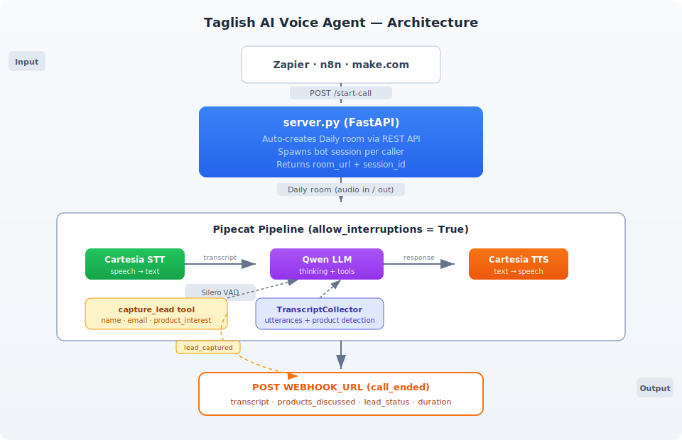

# Taglish AI Voice Insurance Agent

A real-time AI voice agent that speaks natural Taglish (Tagalog + English) to market insurance products to young Filipino professionals. Built with [Pipecat](https://github.com/pipecat-ai/pipecat), it joins a Daily video room, listens to callers via Cartesia STT, thinks with Qwen LLM, and responds with Cartesia TTS — all with support for voice interruptions.

Now API-driven: trigger call sessions from Zapier, n8n, make.com, or any automation platform via `POST /start-call`.

## Products the agent covers

| Product | Target audience |
|---|---|
| **WanderSafe Travel Insurance** | Travelers (Korea, Japan, Europe) |
| **GadgetShield Plus** | Remote workers with expensive devices |
| **IncomeGuard Critical Illness** | Employees who want coverage beyond their HMO |
| **FurParent Vet Care** | Millennial/Gen Z pet owners |

## Architecture



The pipeline runs inside [Pipecat](https://github.com/pipecat-ai/pipecat) and supports real-time interruptions via `allow_interruptions=True`.

## File structure

| File | Purpose |
|---|---|
| `server.py` | FastAPI app — HTTP trigger, Daily room creation, session management |
| `pipeline.py` | Bot pipeline — `create_and_run_bot()` runner with transport, services, event handlers |
| `bot_config.py` | Config loader — reads `prompts.json`, exports shared constants |
| `prompts.json` | Externalized prompts and product definitions (greeting, system prompt, product keywords) |
| `transcript.py` | `TranscriptCollector` — captures utterances, detects product mentions |
| `tools.py` | LLM tool builder — `capture_lead` tool + webhook handler |
| `prompt_builder.py` | System prompt assembler with caller/focus injection |
| `bot.py` | Thin entry point — standalone CLI runner (`python bot.py`) |
| `webhooks.py` | Webhook utilities — post-call transcript + lead capture POST helpers |

## Prerequisites

- Python 3.9+
- [uv](https://github.com/astral-sh/uv) (recommended) or pip
- Accounts and API keys for:
  - [Daily](https://www.daily.co/) — video/audio room transport + REST API for room creation
  - [Cartesia](https://cartesia.ai/) — STT + TTS (`sonic-3.5` model, Tagalog voice)
  - [DashScope / Alibaba Cloud](https://dashscope.aliyuncs.com/) — Qwen LLM

## Setup

1. Clone the repo and install dependencies:

   ```bash
   uv sync
   ```

2. Copy the example env file and fill in your keys:

   ```bash
   cp .env.example .env
   ```

   | Variable | Required | Description |
   |---|---|---|
   | `DAILY_API_KEY` | **Yes** | Daily API key for auto-creating rooms via REST API |
   | `CARTESIA_API_KEY` | **Yes** | Cartesia API key (used for both STT and TTS) |
   | `CARTESIA_VOICE_ID` | **Yes** | Cartesia voice ID for Tagalog output |
   | `DASHSCOPE_API_KEY` | **Yes** | DashScope API key for Qwen LLM |
   | `DAILY_ROOM_URL` | No* | Fallback room URL for standalone mode (`python bot.py`) |
   | `WEBHOOK_URL` | No | URL to receive post-call summaries and lead capture events |
   | `OPENAI_API_KEY` | No | OpenAI API key (optional, for future use) |
   | `DEEPGRAM_API_KEY` | No | Deepgram API key (optional, for future use) |

   *`DAILY_ROOM_URL` is only needed when running `bot.py` directly without the server.

## Running the bot

### API server mode (recommended)

Start the FastAPI server:

```bash
uv run uvicorn server:app --host 0.0.0.0 --port 8000
```

Interactive API docs available at `http://localhost:8000/docs`.

Trigger a call session:

```bash
curl -X POST http://localhost:8000/start-call \
  -H "Content-Type: application/json" \
  -d '{
    "caller_info": {"name": "Juan Dela Cruz", "email": "juan@example.com"},
    "product_focus": "WanderSafe"
  }'
```

Response:

```json
{
  "session_id": "a1b2c3d4e5f6",
  "room_url": "https://yourdomain.daily.co/voice-agent-xxxx",
  "room_name": "voice-agent-xxxx",
  "status": "started"
}
```

### Standalone mode

Run the bot directly with a pre-created room:

```bash
uv run python bot.py
```

Requires `DAILY_ROOM_URL` in your `.env`.

## API Endpoints

| Method | Path | Description |
|---|---|---|
| `GET` | `/health` | Liveness check with active session count |
| `POST` | `/start-call` | Trigger a new call session (auto-creates Daily room) |
| `POST` | `/lead-capture` | Manually send a lead capture webhook |
| `GET` | `/sessions` | List all sessions since server start |

## Webhooks

### Post-Call Summary (`call_ended`)

Fired when a participant leaves the call. Sent to `WEBHOOK_URL`:

```json
{
  "event": "call_ended",
  "session_id": "a1b2c3d4e5f6",
  "room_url": "https://yourdomain.daily.co/voice-agent-xxxx",
  "duration_seconds": 127.3,
  "transcript": [
    {"role": "user", "text": "Hi, I want to know about travel insurance"},
    {"role": "assistant", "text": "Grabe, ang travel goals mo ha! ..."}
  ],
  "products_discussed": ["WanderSafe Travel Insurance"],
  "lead_status": "captured"
}
```

### Lead Capture (`lead_captured`)

Fired mid-conversation when the LLM detects caller interest and contact info:

```json
{
  "event": "lead_captured",
  "session_id": "a1b2c3d4e5f6",
  "name": "Juan Dela Cruz",
  "email": "juan@example.com",
  "product_interest": "WanderSafe Travel Insurance"
}
```

## Behavior

- Greets callers in natural Taglish and introduces all four products
- Answers questions about any of the four insurance products
- Gently redirects off-topic questions back to the products
- Never uses formal/deep Tagalog — keeps the tone casual and conversational
- Keeps responses to 1–3 sentences, optimized for voice
- Uses the `capture_lead` tool when a caller shares contact info and shows product interest
- Sends a full transcript + summary webhook when the call ends
